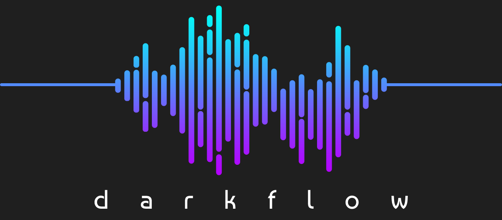

# Darkflow Persian Music Recommendation on Lyrics

[](LICENSE)

## About
the target og this project is identifying topic of each persian song, whith unsupervised process by **LDA** method of topic modelling

## Online Test in Colab
 
We currently have three topics : **Hip Hop & Gang** & **Romantic** & **Religious** 
you can test online this AI model in the link below:

[](https://colab.research.google.com/drive/1ZPCBFLZW_5ZhnO0cnVW40DtMWKp48OR0?usp=sharing)


## DataSet
data set contains 800 lyrics of **Hip Hop Diss & Gang** Tracks & **Romantic** songs & **Religious** songs
i fetch 554 lyric from [RadioJavan](https://radiojavan.com) songs with [RadioJavanApi](https://github.com/xHossein/radiojavanapi/)
and fetch 225 lyric from [beharalashar](https://www.beharalashar.ir) with web scrapping and insert all to Postgresql database

## Natural Language Processing Libraries
i used [Stanza](https://github.com/stanfordnlp/stanza) and [Hazm](https://github.com/sobhe/hazm/) for natural language processing for Perian language

## LDA Training
i used [tomotopy](https://github.com/bab2min/tomotopy) library for LDA training

## Stop Word
for remove Stop Words, i used [Stop Word list](https://github.com/rahmanidashti/PersianStopWords/) prepared by Rahmani Dashti


# Files & Package Structure
    
    ├── data                          # For data handling
    │   ├── Database.py               # Interaction with database   
    │   ├── FetchSongRadioJavan.py    # Fetch lyrics from RadioJavan
    │   └── WebScrappingPraise.py     # Fetch lyrics from Beharalashar
    |
    ├── model                         # Model classes
    │   ├── SongCategory.py           # Song Category Enum
    │   └── SongTokensModel.py        # Song Tokens Model
    |
    ├── nlp                           # NLP Classes         
    │   ├── CountVector.py            # Count Vector
    │   ├── LDAModelTraining.py       # LDA Model training & test       
    │   ├── NlpProcess                # normalize & tokenize & lemmatize   
    │   └── StopWords.py              # check each token is StopWord
    |
    ├── resources                     # resource files
    │   ├── word-cloud.png            # word cloud image
    │   ├── stopwords_all.txt         # list of stopwords
    │   └── test_data.txt             # text file to insert lyric to test model 
    |
    ├── training_model                
    │   └── lda_model.bin             # prepared model
    │
    └── utils                
        └── utils.py                  # utils for check has numbers & remove punctuation

## License
```
MIT License

Copyright (c) 2021 Mohammad amin abbasi

Permission is hereby granted, free of charge, to any person obtaining a copy
of this software and associated documentation files (the "Software"), to deal
in the Software without restriction, including without limitation the rights
to use, copy, modify, merge, publish, distribute, sublicense, and/or sell
copies of the Software, and to permit persons to whom the Software is
furnished to do so, subject to the following conditions:

The above copyright notice and this permission notice shall be included in all
copies or substantial portions of the Software.

THE SOFTWARE IS PROVIDED "AS IS", WITHOUT WARRANTY OF ANY KIND, EXPRESS OR
IMPLIED, INCLUDING BUT NOT LIMITED TO THE WARRANTIES OF MERCHANTABILITY,
FITNESS FOR A PARTICULAR PURPOSE AND NONINFRINGEMENT. IN NO EVENT SHALL THE
AUTHORS OR COPYRIGHT HOLDERS BE LIABLE FOR ANY CLAIM, DAMAGES OR OTHER
LIABILITY, WHETHER IN AN ACTION OF CONTRACT, TORT OR OTHERWISE, ARISING FROM,
OUT OF OR IN CONNECTION WITH THE SOFTWARE OR THE USE OR OTHER DEALINGS IN THE
SOFTWARE.
```
